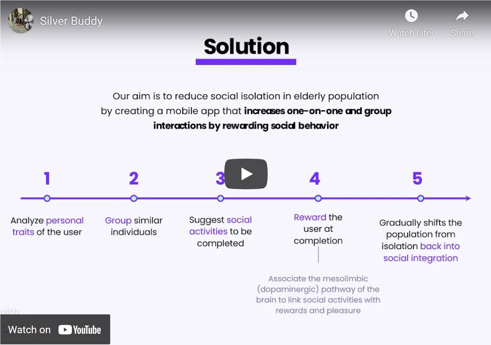

# Silver Buddy

Our application "Sliver Buddy" is to reduce social isolation in the elderly population by creating a mobile app that increases one-on-one and group interactions by rewarding social behaviour. 
   
<i>This project was a part of [MedHacks2021](https://devpost.com/software/silver-buddy).</i>   

## Inspiration
The world pandemic that began in 2019 forced us to be isolated without choice. Physical and social distancing measures due to the rise covid-19 cases and many deaths worldwide left us devastated and alone. Having seen the destruction of social isolation in the last two years, our team believes loneliness is as dangerous as the pandemic itself --it is the new pandemic. We wanted to focus on the topic of isolation in the old population to help them live the rest of their lives in joy and in good health. 

## What it does
Ultimately trains the users to enjoy social interactions, preventing serious health outcomes. We wanted to exploit the mesolimbic pathway of the brain to link social interaction to reward, such that the users would enjoy the time spent with others more than solitude. We used a star system as a reward to the users for taking on our quests.

## How we built it
We used flutter for the front end structure and Google Cloud Firestore for the backend development. We stored the user data in the firebase storage. With Google Cloud Firestore, we were able to implement numerous functionality like sign in, sign out, and messaging with ease. 
For the personality trait assay, we used IPIP (International Personality Item Pool) survey questionnaires and K-means clustering to group individuals based on similarity. This allowed us to identify numeric values of the five factors including: extroversion, neuroticism. agreeableness, conscientiousness, and openness. The five factors were plotted in a 5-dimensional space and clustered into 10 personality types. Thus, we were able to initiate quests and buddy-match based on similar traits. Among the same personality group users, their five personality traits were reduced from 5-dimensional array to 2-dimension array through Principal Component Analysis. The similarity scores between individuals were calculated using Euclidean distance metrics, given in percentage. 

## What we learned
Sickness comes with aging, yet many times, it was not the physiological changes of the body that caused the disease. Rather, the deteriorating mental health when the individual drifted from social connection caused all serious health concerns. What was seemingly impossible, the panacea for all health complications of an old age group, became possible with our simple idea. The social integration of individuals can prevent a myriad of diseases.

## What's next for Silver Buddy
Improved matching system using K-means clustering algorithm. Also, a ranked system is coming down the pipeline to better improve the reward aspect. Competitive, exciting, addicting aspects of mobile games will be incorporated to motivate the users to take on new quests.
